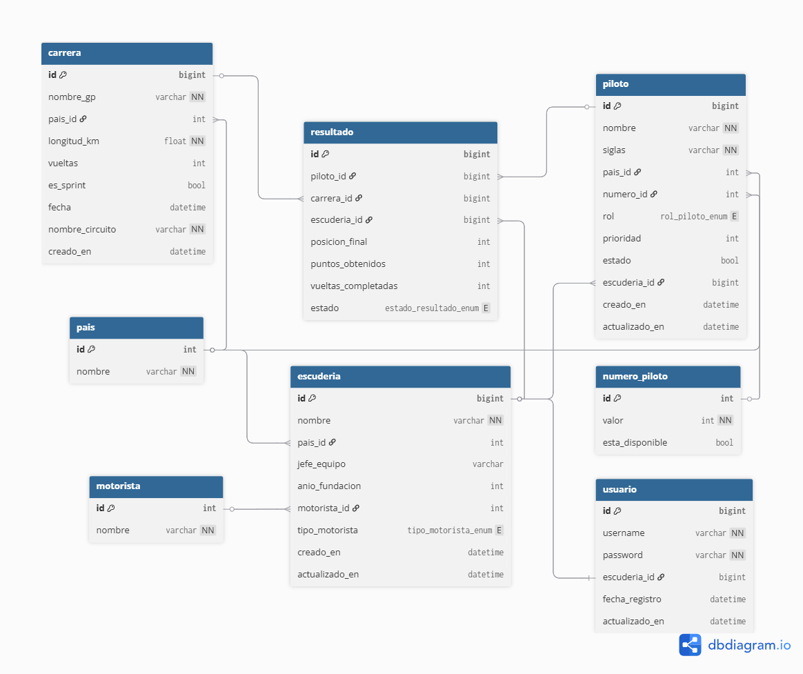

# 🏎️ F1 Team Manager — API REST (Sistema SaaS)

Backend completo para una plataforma SaaS orientada a la gestión estratégica de escuderías de Fórmula 1. Implementa una arquitectura desacoplada en capas, seguridad perimetral por tokens JWT y aislamiento estricto de recursos por director de equipo.

---

## 📋 Índice

1. [Contexto y Modelo de Negocio](#contexto)
2. [Arquitectura de Software](#arquitectura)
3. [Diseño de Base de Datos](#base-de-datos)
4. [Reglas de Negocio](#reglas-de-negocio)
5. [Stack Tecnológico](#stack)
6. [Guía de Ejecución](#ejecución)
7. [Endpoints Principales](#endpoints)
8. [Testing](#testing)

---

## 📌 Contexto y Modelo de Negocio <a name="contexto"></a>

Esta API no es un simple catálogo de lectura de datos, sino un **sistema transaccional** donde cada usuario autenticado asume el rol de **Director de Equipo (Team Principal)** de una escudería específica.

### 🛡️ Regla de Oro: Aislamiento de Mánager

La arquitectura de seguridad garantiza el aislamiento total entre competidores. El sistema extrae el identificador único del equipo (`escuderia_id`) directamente desde el token **JWT** enviado en las cabeceras HTTP. Ningún mánager puede registrar, modificar ni eliminar pilotos pertenecientes a escuderías rivales.

---

## 🏛️ Arquitectura de Software <a name="arquitectura"></a>

La aplicación sigue una **Arquitectura Multicapa** estricta:

```
Controller → Service → Repository
```

Para desacoplar la base de datos de la capa de presentación se implementaron **DTOs (Data Transfer Objects)**:

| DTO | Rol |
|---|---|
| `PilotoRequestDTO` | Entrada de datos con validaciones estrictas (`@NotBlank`, `@Size`, `@Min`) |
| `PilotoResponseDTO` | Salida limpia hacia el cliente, transforma relaciones en tipos legibles |

> **Nota:** El uso de DTOs planos neutraliza los errores de serialización cíclica (JSON infinito) generados por relaciones bidireccionales de Hibernate.

---

## 📊 Diseño de Base de Datos <a name="base-de-datos"></a>

El esquema de persistencia se modeló aplicando la **Tercera Forma Normal (3NF)** en MySQL, con **8 entidades** estratégicamente relacionadas.



### Decisiones Arquitectónicas Clave

**A. Capa de Seguridad y Dominio (Relación 1:1)**

La tabla `usuario` maneja exclusivamente credenciales y se vincula mediante una clave foránea única (`escuderia_id`) a su escudería. Esto aísla la lógica de autenticación de la lógica de negocio.

**B. Integridad Histórica — Entidad `Resultado` (Relación N:M)**

Resuelve la relación Muchos a Muchos entre `Piloto` y `Carrera` actuando como entidad de asociación con doble propósito:

1. **Congelar el historial de mercado:** Persiste el `escuderia_id` en el momento exacto de cada carrera. Los pilotos pueden ser transferidos en el futuro sin alterar el historial de puntos de su antiguo equipo.
2. **Libro mayor de constructores:** Permite consultar el rendimiento exacto del equipo en cada Gran Premio a lo largo del tiempo, independientemente de qué pilotos conducían en esa temporada.

**C. Tablas Maestras (Normalización)**

| Tabla | Propósito |
|---|---|
| `pais` | Centraliza la geografía de Circuitos, Escuderías y Pilotos |
| `motorista` | Catálogo de proveedores de unidades de potencia |
| `numero_piloto` | Gestiona dorsales y su disponibilidad en la parrilla actual |

---

## ⚙️ Reglas de Negocio <a name="reglas-de-negocio"></a>

Toda la lógica de negocio reside en la **capa Service**:

1. **Aislamiento de Mánager:** Un usuario autenticado solo puede ejecutar operaciones `POST` o `PUT` sobre pilotos cuya `escuderia_id` coincida con la registrada en su token JWT.

2. **Reserva Automática de Dorsal:** Al registrar un nuevo piloto, el sistema valida en la tabla `numero_piloto` que el dorsal elegido tenga `esta_disponible = true`. Tras la asignación, el dorsal pasa a `false`. En transferencias de equipo, el piloto conserva su número personal.

3. **Inmutabilidad del Pasado:** Los registros en `Resultado` nunca se eliminan. Las carreras finalizadas son registros históricos de solo lectura.

4. **Política de Eliminación (Hard Delete):** Solo se permite eliminar físicamente a un piloto si **no posee registros** en la tabla `Resultado`. Si ya compitió, el sistema lanza una excepción para preservar la integridad estadística.

---

## 🛠️ Stack Tecnológico <a name="stack"></a>

| Componente | Tecnología |
|---|---|
| Lenguaje | Java 21 |
| Framework | Spring Boot 3.x |
| Seguridad | Spring Security + JWT |
| ORM | Spring Data JPA / Hibernate |
| Base de Datos | MySQL |
| Validaciones | Spring Boot Starter Validation |
| Testing | JUnit 5, Mockito, Spring MockMvc |

---

## 🚀 Guía de Ejecución <a name="ejecución"></a>

### Requisitos Previos

- **Java 21** instalado y configurado en el PATH.
- Instancia activa de **MySQL Server** (phpMyAdmin, Workbench u otro cliente).

### 1. Configurar Base de Datos

Localice `src/main/resources/application.properties` y adapte las credenciales:

```properties
spring.application.name=api-principal

# Archivo: src/main/resources/application.properties

# Configuración de la conexión a MySQL/MariaDB
spring.datasource.url=jdbc:mysql://localhost:3306/f1_api_db?createDatabaseIfNotExist=true&serverTimezone=UTC
spring.datasource.username=root
spring.datasource.password=
spring.datasource.driver-class-name=com.mysql.cj.jdbc.Driver

# Configuración de Hibernate (traductor de Java a SQL)
spring.jpa.hibernate.ddl-auto=update
spring.jpa.show-sql=true
spring.jpa.open-in-view=false

# Spring Espera a que Hibernate cree las tablas antes de meter datos
spring.jpa.defer-datasource-initialization=true

# Spring Siempre ejecuta el archivo data.sql al arrancar
spring.sql.init.mode=always
```

### 2. Compilar y Ejecutar

# Importante
Debe estar corriendo xampp con apache y MySQL para que compile correctamente
```bash
mvn spring-boot:run 
```
o 
```bash
mvnw spring-boot:run 
```

Verificar que la terminal muestre:
```
Tomcat started on port(s): 8080
```

---

## 🎛️ Endpoints Principales <a name="endpoints"></a>

> Todos los endpoints (excepto `/api/auth/login`) requieren autenticación activa mediante `Authorization: Bearer <TOKEN_JWT>` en las cabeceras HTTP.

| Método | Endpoint | Descripción | Respuesta |
|---|---|---|---|
| `POST` | `/api/auth/login` | Autenticación. Devuelve el Token JWT. | `200 OK` |
| `GET` | `/api/pilotos` | Lista los pilotos de la escudería del mánager logueado. | `200 OK` |
| `POST` | `/api/pilotos` | Registra un nuevo piloto validando DTOs y dorsal. | `201 Created` |
| `PUT` | `/api/pilotos/{id}` | Actualiza datos de un piloto de la propia escudería. | `200 OK` |
| `DELETE` | `/api/pilotos/{id}` | Elimina un piloto si no posee historial de carreras. | `204 No Content` |

---

## 🧪 Testing <a name="testing"></a>
> **Nota técnica** El entorno de pruebas está completamente aislado de la capa de persistencia mediante inyección de *Mocks* (Mockito y `@MockitoBean`). Esto garantiza que los tests unitarios y de integración puedan ejecutarse de forma ultrarrápida sin necesidad de tener el motor de MySQL encendido ni afectar los datos reales.

Para ejecutar el laboratorio de pruebas automatizadas:

```bash
mvn test
```

| Tipo | Herramienta | Qué valida |
|---|---|---|
| **Unitarias (Service)** | JUnit 5 + Mockito | Reglas de negocio: eliminación, aislamiento, asignación de dorsales |
| **Integración (Controller)** | MockMvc + `@WithMockUser` | Peticiones HTTP simuladas sorteando Spring Security de forma controlada |
